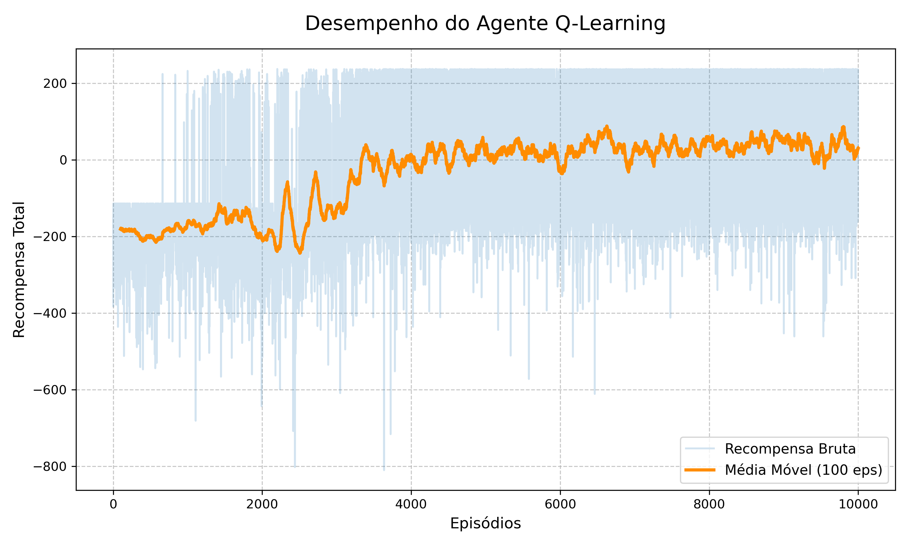

# 🤖 Q-Learning: Navegação do Amongois

Este repositório contém a implementação de um agente de Aprendizado por Reforço (Reinforcement Learning) utilizando o algoritmo **Q-Learning** tabular. O objetivo do agente é aprender a navegar de forma autônoma por um mapa de plataformas em um ambiente interativo, evitando quedas e encontrando o caminho ótimo até o bloco final.

## 📊 Resultados do Treinamento

Abaixo você pode conferir o vídeo demonstrando o comportamento do agente após aprender a melhor política de navegação, além da curva de aprendizado do treinamento.

### Melhor Política Aprendida

https://github.com/user-attachments/assets/d1b41681-6fbe-4cbf-aa21-0b2d5145296f

### Curva de Aprendizado
O gráfico ilustra a transição do agente de uma fase de pura exploração (recompensas negativas devido a quedas frequentes) para a fase de exploração otimizada (recompensas máximas consistentes ao encontrar o bloco final), plotando a Média Móvel de 100 episódios.

### Interpretação da Curva
* **Episódios 0–3500:** Recompensas muito negativas — agente 
  explorando aleatoriamente, morrendo com frequência.
* **Episódios 3500–4500:** Transição — agente começa a encontrar 
  o bloco final esporadicamente.
* **Episódios 4500+:** Convergência — média móvel estabiliza 
  na área positiva, indicando que o agente aprendeu a 
  política ótima de forma consistente.

## 📁 Estrutura do Repositório

* `midia/`: Pasta contendo os arquivos visuais e de demonstração:
  * `Aprendizagem por reforço.mp4`: Vídeo demonstrando a melhor política do agente.
  * `grafico_bonito.png`: Gráfico da curva de aprendizado.
* `client.py`: Arquivo principal contendo a lógica do agente, hiperparâmetros, loop de treinamento, política epsilon-greedy e sistema de salvamento automático (*checkpoints*).
* `connection.py`: Módulo auxiliar responsável pela comunicação via *socket* (porta 2037) com o servidor local do jogo.
* `resultado.txt`: A Tabela Q (Q-Table) final gerada após o treinamento, contendo as expectativas de recompensa para os 96 estados possíveis e 3 ações.
* `recompensas.txt`: Histórico numérico bruto contendo o somatório das recompensas obtidas pelo agente ao longo de cada episódio.

## ⚙️ Como Funciona o Ambiente

O jogo é rodado localmente e se comunica com o script em Python enviando os estados e recebendo as ações escolhidas pelo algoritmo.

* **Espaço de Estados (States):** O estado é recebido como uma string binária de 7 bits (ex: `1010100`). Os 5 primeiros bits representam a plataforma em que o personagem se encontra (0 a 23), e os 2 últimos representam a direção para qual ele aponta (Norte, Leste, Sul, Oeste). A conversão direta deste binário gera um índice de **0 a 95**, totalizando 96 estados perfeitamente mapeados na matriz.
* **Espaço de Ações (Actions):** O agente possui 3 ações possíveis:
  1. `left`: Girar no próprio eixo para a esquerda.
  2. `right`: Girar no próprio eixo para a direita.
  3. `jump`: Pular para a frente.
* **Sistema de Recompensas (Rewards):** * Movimentação comum: Entre `-1` e `-14` por passo.
  * Queda no buraco (Derrota): `-100`.
  * Chegada no bloco preto (Vitória): `+300`.

## 🧠 Algoritmo e Estratégia de Treinamento

O núcleo da inteligência do agente baseia-se no **Q-Learning**, um algoritmo clássico de Aprendizado por Reforço *model-free* (livre de modelo). A cada passo no ambiente, o agente atualiza sua matriz de conhecimento (Q-Table) iterativamente utilizando a seguinte equação de atualização:

$$Q(s, a) \leftarrow Q(s, a) + \alpha \left[ R + \gamma \max_{a'} Q(s', a') - Q(s, a) \right]$$

**Onde:**
* $Q(s, a)$: Valor de utilidade esperado para tomar a ação $a$ estando no estado $s$.
* $\alpha$ (Alpha): Taxa de aprendizado.
* $R$: Recompensa imediata recebida após a ação.
* $\gamma$ (Gamma): Fator de desconto para recompensas futuras.
* $\max_{a'} Q(s', a')$: A maior estimativa de recompensa possível no próximo estado $s'$.

### Política Epsilon-Greedy ($\epsilon$-Greedy)
Para garantir que o agente não fique preso em rotas subótimas desde o início, aplicamos a estratégia de seleção de ações **Epsilon-Greedy**, que equilibra dinamicamente a Exploração (*Exploration*) e o Aproveitamento (*Exploitation*).

### 📉 Cronograma de Decaimento Logarítmico (`decay_schedule`)
Para otimizar a convergência e evitar mudanças abruptas, tanto a **Taxa de Exploração ($\epsilon$)** quanto a **Taxa de Aprendizado ($\alpha$)** utilizam a mesma função customizada de decaimento logarítmico baseado em `np.logspace`. 

Esta função gera uma curva matemática que decresce mais rapidamente nos episódios iniciais e vai suavizando conforme se aproxima do fim do seu ciclo. Ao atingir o limite estipulado pela proporção de passos (`decay_ratio`), o valor é congelado (*padding* por borda) para garantir que o agente passe o restante do treino refinando o conhecimento de forma estável.

Os hiperparâmetros foram ajustados com escalas de decaimento dinâmico ao longo dos episódios:

* **Fator de Desconto ($\gamma$):** Fixo em `0.95`. Prioriza levemente o planejamento de curto/médio prazo para garantir que o agente foque em chegar ao fim do nível rapidamente.
* **Taxa de Exploração ($\epsilon$):** Inicia em `1.0` (100% de ações aleatórias - focado em explorar o mapa) e decai para `0.1` ao longo de 80% do treinamento. Com o tempo, a estratégia Epsilon-Greedy passa a escolher as melhores ações conhecidas na Tabela Q em 90% das vezes (*Exploitation*).
* **Taxa de Aprendizado ($\alpha$):** Inicia de forma agressiva em `0.5` e decai gradualmente para `0.01` ao longo da primeira metade do treinamento, permitindo uma estabilização fina da Tabela Q nas rotas finais.
* **Resiliência e Checkpoints:** O script `client.py` possui um sistema inteligente de leitura e escrita. O progresso é salvo a cada 10 episódios. Caso o processo seja interrompido, ao rodar novamente, ele carrega o histórico e a matriz `resultado.txt`, continuando o treinamento exatamente de onde parou.

## 💾 Sistema de Checkpoint
O treinamento é salvo automaticamente a cada 10 episódios 
em `resultado.txt` e `recompensas.txt`. Para retomar de 
onde parou, basta rodar `python3 client.py` novamente — 
o script detecta os arquivos e continua do episódio correto.

Para iniciar um treinamento do zero:
rm resultado.txt recompensas.txt

## 🚀 Como Executar

### Pré-requisitos
pip install numpy matplotlib

### Passo a passo
1. Baixe o ambiente Unity 
2. Dê permissão de execução ao binário:
chmod +x 'Aprendizagem por Reforco.x86_64'

3. Em dois terminais separados:

**Terminal 1 — Ambiente:(exemplo com linux)**
cd linux/
./'Aprendizagem por Reforco.x86_64'

**Terminal 2 — Agente (treino):**
python3 client.py

**Para rodar a política ótima (sem treino):**
python3 run.py
